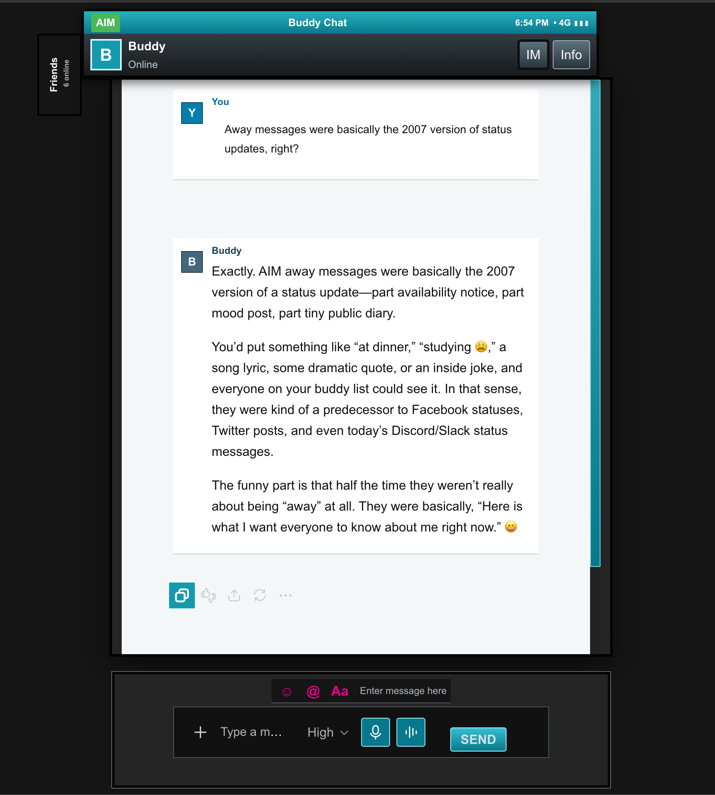

# Sidekick-chat-shell
A retro Sidekick/AIM-inspired chat interface built with JavaScript, CSS, DOM manipulation, and the Web Audio API.

## About the Project

Sidekick Chat Shell is a browser userscript that transforms the standard ChatGPT web interface into a retro instant-messaging experience inspired by early-2000s Sidekick and AIM interfaces.

What began as a visual customization experiment evolved into a functional interface that combines custom styling with JavaScript-driven DOM manipulation, browser event handling, audio feedback, and dynamic page monitoring.

The project was designed to preserve the underlying chat functionality while presenting it through a completely different user experience.

## Features

- Retro Sidekick/AIM-inspired interface
- Custom Buddy Chat header and contact panel
- Live local clock
- Simulated 4G and signal indicators
- Custom user and assistant identities
- Transcript-style message layout
- Custom Sidekick-style SEND button
- Working microphone and dictation controls
- Synthesized outgoing message sound
- Synthesized incoming message notification
- Styled code blocks and copy controls
- Internal conversation scrolling
- Responsive layout for smaller browser windows
- Automatic interface restoration after dynamic page updates

## Technologies

`JavaScript` `CSS` `DOM API` `MutationObserver` `Web Audio API` `Browser Events` `Responsive Design` `Violentmonkey`

## How It Works

### Dynamic Interface Rendering

Modern web applications frequently redraw portions of the page without performing a full refresh.

Sidekick Chat Shell uses `MutationObserver` to monitor DOM changes and restore custom interface components when the underlying application updates.

This allows the Sidekick shell to remain active while new messages are created and responses are streamed.

### Web Audio Notifications

Message sounds are generated directly in the browser using the Web Audio API.

Instead of loading external audio files, the script creates notification tones using oscillators and gain nodes.

Separate sound patterns are used for outgoing and incoming messages.

### Response Completion Detection

The script monitors the assistant response state to determine when a message has finished generating.

When generation completes, an incoming-message notification is played once.

A secondary timing-based fallback is included to help maintain this behavior if parts of the page structure change.

### Custom Composer

The native message composer is adapted into a Sidekick-style control panel while retaining important functionality such as:

- Text input
- Microphone access
- Dictation controls
- Message sending

A custom SEND button is layered into the interface while preserving access to the underlying message submission behavior.

## Installation

### Requirements

- A compatible web browser
- A userscript manager such as Violentmonkey
- Access to ChatGPT through the browser

The current version was developed and tested using Violentmonkey in Vivaldi.

### Setup

1. Install Violentmonkey or another compatible userscript manager.
2. Open the userscript manager and create a new script.
3. Open `sidekick-chat-shell.user.js` from this repository.
4. Copy the entire script into the userscript editor.
5. Save the script.
6. Open or refresh `https://chatgpt.com/`.
7. Click once inside the page after loading to allow browser audio playback.

## Current Version

### v0.5.3

The current public version includes:

- Complete Sidekick-inspired interface
- Custom message presentation
- Live clock and status indicators
- Send and receive notification sounds
- Custom SEND control
- Microphone and dictation compatibility
- Dynamic DOM monitoring
- Responsive layout

## Development Challenges

Building the interface required solving several issues created by modifying a dynamic web application.

Some of the main challenges included:

- Preventing native message bubbles from overriding custom styling
- Maintaining message alignment after dynamic page updates
- Creating an independent scrolling region
- Working around browser restrictions on automatic audio playback
- Detecting when streamed responses have completed
- Preventing the custom SEND control from blocking microphone and dictation controls
- Reapplying interface components after React-based DOM updates
- Preserving core functionality while removing or restyling native interface elements

## Project Structure

```text
sidekick-chat-shell/
├── LICENSE
├── README.md
├── sidekick-chat-shell.user.js
└── sidekick-chat-shell-preview.png
